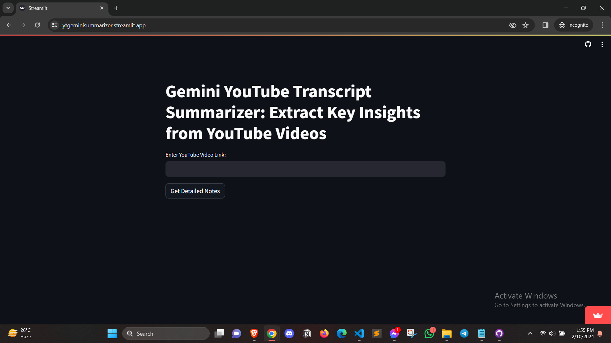

# Cogniflow AI — ask your media, get cited answers

**Cogniflow is a multimodal RAG (Retrieval-Augmented Generation) engine: ingest YouTube videos, podcasts, and PDFs, then query them in plain language and get answers with source citations.**

**Status:** v1 shipped and working (YouTube transcript summarizer — see below). v2 — the full multimodal retrieval engine — is in active development.

```
v1  ✅ YouTube → transcript → structured summary          (live, this repo)
v2  🚧 Podcast audio ingestion (auto-transcribe)          (building)
v2  🚧 PDF ingestion with real-time document parsing      (building)
v2  🚧 Chunking + vector retrieval, tuned for <10s answers (building)
v2  🚧 Citation UI — every answer links back to its source (building)
```

## v1 — what works today

Paste any YouTube link → Cogniflow pulls the transcript (via `youtube-transcript-api`), sends it to Google's Gemini with a summarization prompt, and returns a concise, structured summary with key insights — inside a Streamlit UI.



## Run v1 locally

```bash
git clone https://github.com/shihabcodes/Cogniflow_AI && cd Cogniflow_AI
pip install -r requirements.txt
echo "GOOGLE_API_KEY=your_key_here" > .env
streamlit run app.py        # → http://localhost:8501
```

## v2 architecture (in development)

```
ingest (YouTube | audio | PDF)
        │
        ▼
normalize → chunk → embed → vector store
        │
        ▼
query → retrieve top-k → Gemini (grounded prompt)
        │
        ▼
answer + source citations (chunk-level links)
```

The hard parts being worked through: chunk-size vs. retrieval-quality tradeoffs, keeping end-to-end latency under 10 seconds on long transcripts, and citation granularity fine enough to be trustworthy.

## Why this project exists

Every creator, student, and researcher sits on hours of content they can't search. Cogniflow turns that pile into a queryable knowledge base — the same way you'd ask a colleague who watched everything.

## License

MIT — see [LICENSE](LICENSE).
